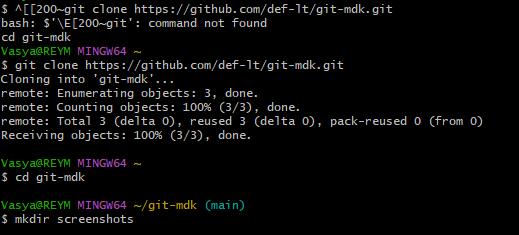
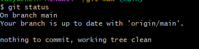
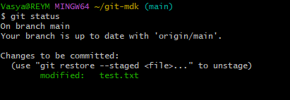
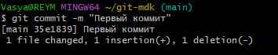
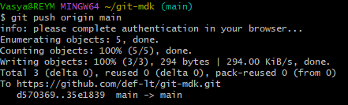
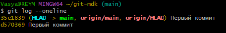

# Отчёт по Git

## 1. git clone

**Для чего используется:** Скачивает (клонирует) удалённый репозиторий на компьютер.

**Пример:**

git clone https://github.com/def-lt/git-mdk.git

## 2. git status

**Для чего используется:** Показывает текущее состояние файлов в репозитории.

**Пример:**

git status

## 3. git add

**Для чего используется:** Добавляет файлы в индекс (подготавливает к коммиту).

**Пример:**

git add .

## 4. git commit

**Для чего используется:** Сохраняет изменения в истории репозитория.

**Пример:**

git commit -m "Первый коммит"

## 5. git push

**Для чего используется:** Отправляет коммиты на GitHub.

**Пример:**

git push origin main

## 6. git pull

**Для чего используется:** Скачивает изменения с GitHub.

**Пример:**

git pull

## 7. git log

**Для чего используется:** Показывает историю коммитов.

**Пример:**

git log --oneline

